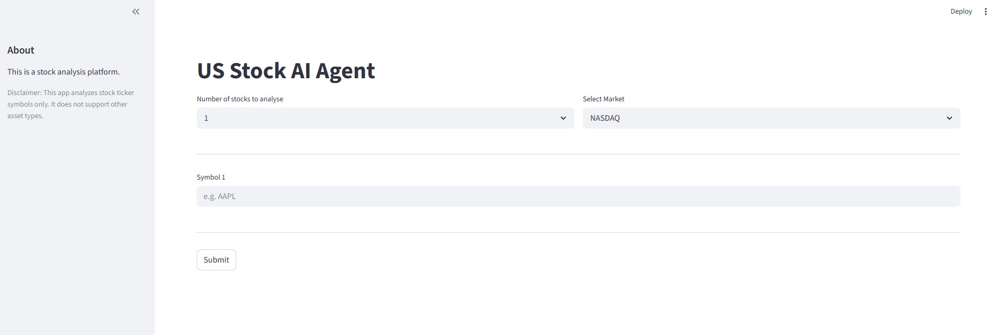

# Stock Analyser with AI

A Streamlit app that fetches stock data from Alpha Vantage, displays charts with moving averages, and generates AI-powered insights using an OpenAI-compatible LLM.

## Landing page



## Tech Stack

- **Python 3.10+**
- **Streamlit** - Web UI
- **pandas / matplotlib** - Data processing and charting
- **LangChain + OpenAI** - LLM integration (Perplexity API)
- **Alpha Vantage** - Stock market data

## Project Structure

```
├── ui_app.py                 # Streamlit UI entry point
├── stock_utility_handler.py  # Alpha Vantage client & chart plotting
├── ai_insights_handler.py    # LLM wrapper for insights
├── llm_config.py             # Model configuration
├── img/                      # Generated chart PNGs (created at runtime)
└── pyproject.toml            # Dependencies
```

## Getting Started

### 1. Install uv (if not installed)

```bash
pip install uv
```

### 2. Set up environment variables

Create a `.env` file in the project root:

```
ALPHAVANTAGE_API_KEY=your_alpha_vantage_key
PPLX_API_KEY=your_perplexity_key
```

Get your API keys:
- Alpha Vantage: https://www.alphavantage.co/
- Perplexity: https://www.perplexity.ai/

### 3. Install dependencies and run

```bash
uv sync
uv run streamlit run ui_app.py
```

The app will open at `http://localhost:8501`.

## How graphs are generated

Charts are built from Alpha Vantage daily time-series data (~100 days) and saved as PNGs in the project’s `img/` folder.

1. **Data** – For each symbol and market, the app requests `TIME_SERIES_DAILY` from Alpha Vantage, converts it to a pandas DataFrame (date index, `close`, `volume`), and applies the exchange timezone for labels.

2. **Plot layout** – Each chart is a single figure with three stacked subplots (matplotlib):
   - **Closing price** – Line plot of daily close over time (blue).
   - **Volume** – Bar chart of daily trading volume (green).
   - **Moving averages** – Closing price (blue) with 7-day MA (orange) and 20-day MA (red). MAs are computed with a rolling window on the close series.

3. **Axes** – Dates use the exchange timezone; major ticks are monthly and minor ticks weekly. The figure is saved with `plt.savefig()`.

4. **Output** – One PNG per symbol and market, e.g. `img/NASDAQ_AAPL.png`. The `img/` directory is created automatically if it doesn’t exist. These paths are then used when requesting AI analysis of the chart.

## Supported Markets

| Market | Symbol Format |
|--------|---------------|
| NASDAQ, Dow Jones, S&P 500 | `AAPL`, `MSFT` |
| Singapore | `D05.SI`, `U11.SI` |

## Alpha Vantage Rate Limits

The free tier has strict limitations:

| Tier | Requests/min | Requests/day |
|------|--------------|--------------|
| Free | 25 | 25 |

- Exceeding limits returns `Note` or `Error` in JSON response instead of data
- Consider adding caching/backoff logic for production use
- Premium tiers available for higher limits

## Notes

- **Data**: Uses `TIME_SERIES_DAILY` with ~100 days of history.
- **Model**: Uses `gpt-5.1-mini` via Perplexity. Edit `llm_config.py` to change.
